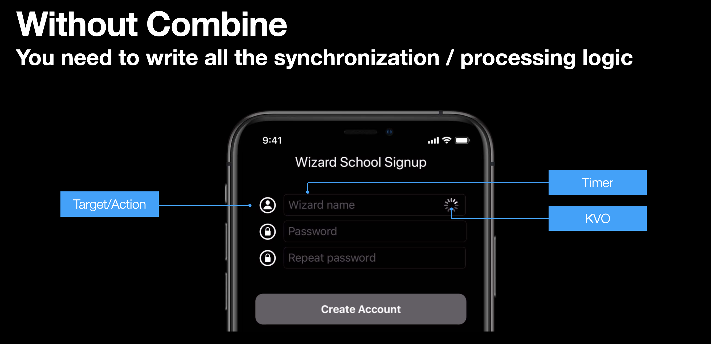
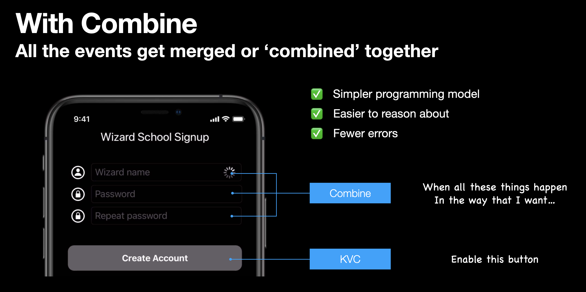
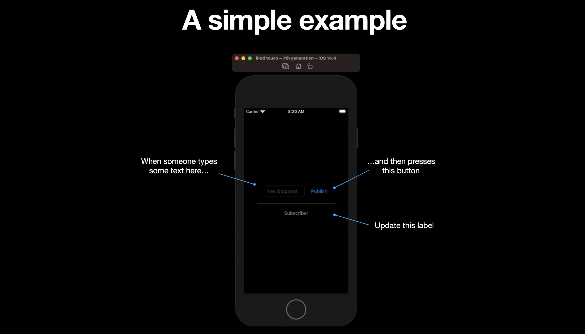
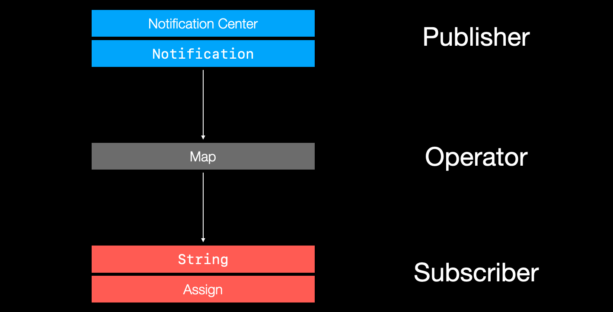
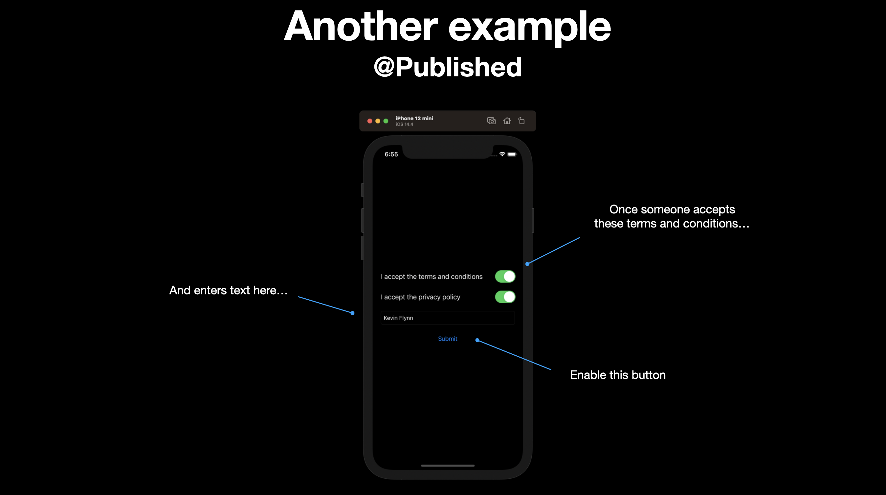
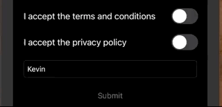
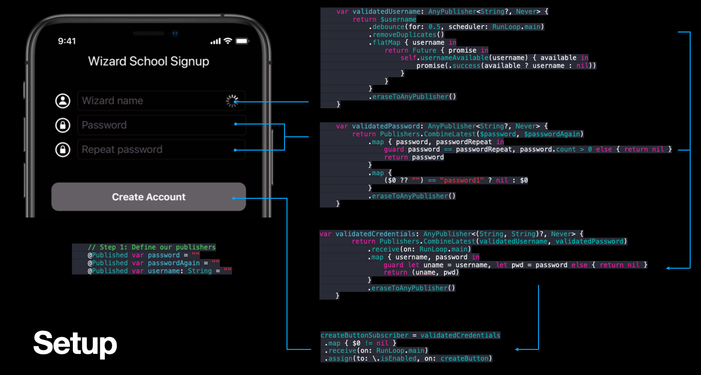
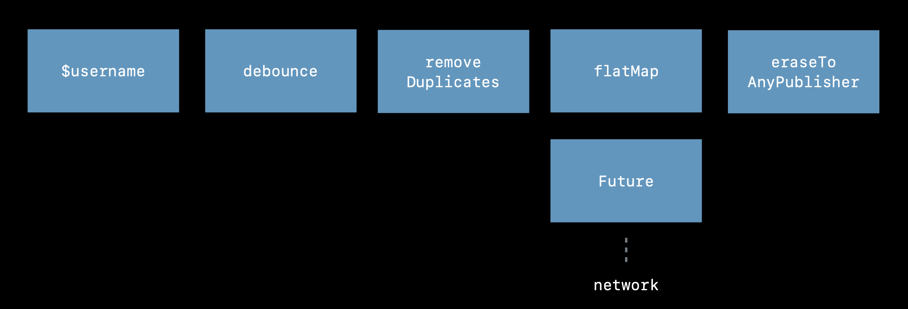

# Getting Started with Combine
[Intro README](/Intro_Example1.md)

## What is Combine?

[Combine](https://developer.apple.com/documentation/combine) is a unified Swift API framework for processing events over time. What kind of events? Mostly **asynchronous** one. Kind kind that fire continuously as our applications are running, making us want to update our UI.

- Target/Action
- Notification center
- URLSession
- Key-Value observing (KVO)
- Ad-hoc callbacks

Combine은 이러한 모든 이벤트를 하나의 흐름 체인으로 스트리밍한 다음 해당 이벤트를 조작할 수 있도록 지원합니다.   
로직을 추가하고 결과를 결정한 다음 최종적으로 UI를 업데이트할 위치와 방법을 결정합니다.

## Where would I use it?

Let's say we are building user registration app. And before a wizard can create an account we need to check that:

- the user's name is unique (asynchronous call to backend server)
- they have entered a valid password, and
- they have correctly entered the repeat password twice

There is a lot of asynchronous eventing going on here.   
1. 사용자가 target-action을 통해 TextField를 탭할 때 수신을 대기해야 한다.   
2. 사용자가 키를 입력할 떄마다 백엔드를 호출할 수는 없다. 따라서 타이머를 설정하고 몇 초마다 요청을 보낼지 정해야한다.  
3. 다음 KVO(Key Value Observing)를 사용하여 사용자 필드의 값이 변경되었음을 스스로 알리고 추가 처리 로직을 실행하여 다른 조건이 충족되었는지 확인할 수 있습니다.



Combine이 하는 일은 이 모든 다양한 이벤트, 논리 및 타이밍을 하나의 스트림으로 결합하는 것입니다.

that we can query, and ask: "Have all these conditions been met."



- `URLSession`에 대한 비동기 호출 결과를 수신 대기할 수 있습니다.
- username, password, and repeat password 필드의 유효성 검사 결과(validation results)를 병합할 수 있습니다.
- 해당 결과를 사용하여 KVC(Key Value Coding)를 통해 Create Account 버튼의 상태를 업데이트할 수 있습니다.

## How does it work?

In this simple example we will use Combine to:

- update a label
- when a button is pressed
- with the contents of the text field



Combine is built around three main abstractions:

- Publishers
- Operators, and
- Subscribers

### Publishers

Publishers는 우리가 받고자(receiving) 하는 events를 publish하거나 fire합니다.

예를 들어, 새로운 글이 입력(published)될 때마다 알림(notification)을 받고 싶다고 가정해보자. `NotificationCenter` 기반의 publisher를 만든 뒤 publish Button을 누르면 바로 실행(fire)할 수 있다

```swift
extension Notification.Name {
    static let newBlogPost = Notification.Name("newPost")
}

struct BlogPost {
    let title: String
}

// Create a publisher
let publisher = NotificationCenter.Publisher(center: .default, name: .newBlogPost, object: nil)
 .map { (notification) -> String? in
     return (notification.object as? BlogPost)?.title ?? ""
}
```

### Operators

Operators는 publishers의 output를 가져와서, String처럼 downstream subscribers가 이해할 수 있는 다른 data types으로 변환한다. 



Operators는 `map`처럼 closure를 사용해서 publishers에서 사용할 수 있다.

```swift
.map { (notification) -> String? in
     return (notification.object as? BlogPost)?.title ?? ""
}
```

### Subscribers

publishers와 operators를 mapping하면, subscribe할 준비가 된다.

Subscription은 2단계로 이뤄진다.
1. subscriber를 만든다.
2. publisher를 subscribe하게 한다.

```swift
// Create a subscriber
let subscriber = Subscribers.Assign(object: subscribedLabel, keyPath: \.text)
publisher.subscribe(subscriber)
```

### Fire the event

사용자가 버튼을 누르면, notification을 publish 할 수 있다.

TextField에서 Text를 가져와서 BlogPost를 만들고, NotificationCenter를 통해 게시(fire)하면 Label이 업데이트된다.

```swift
@objc func publishButtonTapped(_ sender: UIButton) {
    // Post the notification
    let title = blogTextField.text ?? "Coming soon"
    let blogPost = BlogPost(title: title)
    NotificationCenter.default.post(name: .newBlogPost, object: blogPost)
}
```


### Source

**ViewController.swift**

```swift
import UIKit
import Combine

extension Notification.Name {
    static let newBlogPost = Notification.Name("newPost")
}

struct BlogPost {
    let title: String
}

class ViewController: UIViewController {

    @IBOutlet var blogTextField: UITextField!
    @IBOutlet var publishButton: UIButton!
    @IBOutlet var subscribedLabel: UILabel!
    
    override func viewDidLoad(  ) {
        super.viewDidLoad()

        publishButton.addTarget(self, action: #selector(publishButtonTapped), for: .primaryActionTriggered)
        
        // Create a publisher
        let publisher = NotificationCenter.Publisher(center: .default, name: .newBlogPost, object: nil)
         .map { (notification) -> String? in
             return (notification.object as? BlogPost)?.title ?? ""
         }
        
        // Create a subscriber
        let subscriber = Subscribers.Assign(object: subscribedLabel, keyPath: \.text)
        publisher.subscribe(subscriber)
    }
    
    @objc func publishButtonTapped(_ sender: UIButton) {
        // Post the notification
        let title = blogTextField.text ?? "Coming soon"
        let blogPost = BlogPost(title: title)
        NotificationCenter.default.post(name: .newBlogPost, object: blogPost)
    }
}
```

## The @Published Attribute



`NotificationCenter`를 통해 events를 수동으로 실행(firing)하는 것도 Combine을 통해 events를 publish 할 수 있는 방법이다.

다른 하나는 `@Published`를 활용하는 것이다.

### Define your publishers

`@Published`는 지정된 property에 publisher를 추가하는 property wrapper다. 

```swift
@Published private var acceptedTerms = false
@Published private var acceptedPrivacy = false
@Published private var name = ""
```

tracking하려는 state properties에 붙이면, 해당 속성을 직접 publish 할 수 있다. 또한 상태(State)가 바뀔 때마다 messages를 emit한다. 

### Combine publishers into a stream

AnyPublisher를 정의하면, 하나의 간단한 publisher stream을 결합할 수 있다.

```swift
private var validToSubmit: AnyPublisher<Bool, Never> {
    return Publishers.CombineLatest3($acceptedTerms, $acceptedPrivacy, $name)
        .map { terms, privacy, name in
            return terms && privacy && !name.isEmpty
        }.eraseToAnyPublisher()
}
```

publisher는 세 가지 properities를 가져와서 binding `$`를 통해 속성에 accesses한 다음 `map` operator로 output을 하나의 `Bool`로 결합하여 return한다.

`eraseToAnyPublisher`는 map api을 `<Bool, Never>` api로 변환하여, mapping 내부를 노출시키지 않는다.

### Define your subscribers

class based technology이기에 memory leaks을 신경써야한다.   
`AnyCancellable`를 정의함으로써 view controller가 사라질 때, subscriber도 정리(ensure)된다.

```
private var buttonSubscriber: AnyCancellable?
```

### Subscribe

다음과 같이 subscriber를 publisher에 연결한다. 

```swift
buttonSubscriber = validToSubmit
    .receive(on: RunLoop.main)
    .assign(to: \.isEnabled, on: submitButton)
```

publisher stream인 `validToSubmit`을 가져오면

- `.receive(on: RunLoop.main)` : UI의 main thread가 차단(block)되지 않았는지 확인 
- `.assign(to: \.isEnabled, on: submitButton)` button의 `isEnabled` 속성에 `Bool` 결과값을 할당(assign)한다.

publisher stream의 출력을 control(button)의 한 상태로 mapping한다.



**ViewController.swift**

```swift
//
//  ViewController.swift
//  TermsAndConditions
//
//  Created by jrasmusson on 2021-05-21.
//

import UIKit
import Combine

class ViewController: UIViewController {

    @IBOutlet var acceptedSwitch: UISwitch!
    @IBOutlet var privacySwitch: UISwitch!
    @IBOutlet var nameField: UITextField!
    @IBOutlet var submitButton: UIButton!
    
    // Define publishers
    @Published private var acceptedTerms = false
    @Published private var acceptedPrivacy = false
    @Published private var name = ""
    
    // Combine publishers into single stream
    private var validToSubmit: AnyPublisher<Bool, Never> {
        return Publishers.CombineLatest3($acceptedTerms, $acceptedPrivacy, $name)
            .map { terms, privacy, name in
                return terms && privacy && !name.isEmpty
            }.eraseToAnyPublisher()
    }

    // Define subscriber
    private var buttonSubscriber: AnyCancellable?
    
    override func viewDidLoad() {
        super.viewDidLoad()
        nameField.delegate = self
        
        // Hook subscriber up to publisher
        buttonSubscriber = validToSubmit
            .receive(on: RunLoop.main)
            .assign(to: \.isEnabled, on: submitButton)
    }
    
    @IBAction func acceptTerms(_ sender: UISwitch) {
        acceptedTerms = sender.isOn
    }
    
    @IBAction func acceptPrivacy(_ sender: UISwitch) {
        acceptedPrivacy = sender.isOn
    }
    
    @IBAction func nameChanged(_ sender: UITextField) {
        name = sender.text ?? ""
    }
    
    @IBAction func submitAction(_ sender: UIButton) {
    }
}

extension ViewController: UITextFieldDelegate {
    func textFieldShouldReturn(_ textField: UITextField) -> Bool {
        textField.resignFirstResponder()
        return true;
    }
}
```

## Back to Signup View



다양한 publication stream과를 조합하고, UI control의 Single state에 binding할 수 있는 방법을 볼 수 있어야한다.

`@Published`를 붙여 시작한다.

```swift
@Published var password = ""
@Published var passwordAgain = ""
@Published var username: String = ""
```

그런 다음 `UITextFieldDelegate`를 통해 각 TextField에서 입력이 변경될 때, 속성의 상태를 설정하거나 변경한다. 

```swift
extension ViewController: UITextFieldDelegate {
    func textField(_ textField: UITextField, shouldChangeCharactersIn range: NSRange, replacementString string: String) -> Bool {
        let textFieldText = textField.text ?? ""
        let text = (textFieldText as NSString).replacingCharacters(in: range, with: string)
        
        if textField == nameTextField { username = text }
        if textField == passwordTextField { password = text }
        if textField == repeatTextField { passwordAgain = text }
        
        return true
    }
}
```

### Validating the username

사용자 이름이 변경되면, backend service를 asynchronously하게 call하여 username이 사용 가능한지 확인하려 한다.

```swift
var validatedUsername: AnyPublisher<String?, Never> {
    return $username
        .debounce(for: 0.5, scheduler: RunLoop.main)
        .removeDuplicates()
        .flatMap { username in
            return Future { promise in
                self.usernameAvailable(username) { available in
                    promise(.success(available ? username : nil))
                }
            }
        }
        .eraseToAnyPublisher()
}
```

validation publisher는 `$username`에 바인딩하여, 이를 통해 stream에서 처리할 수 있다.

사용자가 새 키를 입력할 떄마다 backend call로 가득 차는 것을 방지해야한다.

이 기능을 `debounce`라고 하는데 `0.5`로 설정하면 main thread에서 실행된느 동안 0.5초마다 call을 제한한다. 

```swift
.debounce(for: 0.5, scheduler: RunLoop.main)
```

사용자가 debounce 시간 내에 동일한 사용자 이름을 입력하면 다시 확인하는 의미가 없으므로 중복 항목을 제거해야한다. 

```swift
.removeDuplicates()
```

이제 asynchronous events를 처리해야한다.

서버로부터 password가 유효한지 알아내야한다. 이를 위해 `usernameAvailable()`라는 기능이 있다.

```swift
func usernameAvailable(_ username: String, completion: (Bool) -> Void) {
    completion(true) // Our fake asynchronous backend service
}
```

backend service를 이용하는 척하면서 유효한 반환값 `true`를 잘라내거나 속이는 것이다.

이 `true`는 TextField에 있는 `username` 원본을 반환하기 위해 `Future`와 `Promise`에서 사용할 수 있는 Closure에서 Bool로 반환된다.

```swift
return Future { promise in
    self.usernameAvailable(username) { available in
        promise(.success(available ? username : nil))
    }
}
```

`Promise`는 `Success` or `Failure`를 반환할 수 있는 Swift의 `Result`이다.

그런 다음 내부 정보를 숨기고 모든 사용자가 사용할 수 있도록 하려면 '.eraseToAnyPublisher()로 끝낸다.

해당 이벤트 처리는 아래 그림처럼 보인다.



### Validating the password

```swift
var validatedPassword: AnyPublisher<String?, Never> {
    return Publishers.CombineLatest($password, $passwordAgain)
        .map { password, passwordRepeat in
            guard password == passwordRepeat, password.count > 0 else { return nil }
            return password
        }
        .map {
            ($0 ?? "") == "password1" ? nil : $0
        }
        .eraseToAnyPublisher()
}
```

암호의 유효성을 검사할 때 암호가 올바른 경우 문자열로 암호를 반환하고, 일치하지 않거나 암호가 잘못된 경우 nil을 반환한다. 

먼저 publisher signature을 정의한다.

```swift
var validatedPassword: AnyPublisher<String?, Never> { .. }
```

그런 다음 우리가 검증하고자 하는 published properties을 결합한다.

```swift
var validatedPassword: AnyPublisher<String?, Never> {
    return Publishers.CombineLatest($password, $passwordAgain)
```

'$password' TextField와 '$passwordAgain' TextField의 값을 결합하고 이러한 필드가 변경될 때마다 publisher에게 호출하도록 한다. 이 방법을 `CombineLatest`라고 한다. 

두 개의 암호 필드가 있으면 해당 필드에 대해 자유롭게 처리할 수 있다.

먼저 두 필드 값이 동일한지 확인한 다음 암호의 길이가 1 이상인지 확인한다.

그리고 유효한 경우에는 password을 반환하고 ,그렇지 않은 경우에는 nil을 반환한다.


```swift
.map { password, passwordRepeat in
    guard password == passwordRepeat, password.count > 0 else { return nil }
    return password
}
```

그런 로직의 결과를 publisher의 다음 비트로 전달하면, 다시 `map`연산자를 사용하여 사용자가 사용하지 않는 일반적인 암호와 동일한지 확인한다.

만약 `password1`와 동일하면 `nil`을 반환하고, 아니면 계속해서 전달된 암호를 반환한다. 

```swift
.map {
    ($0 ?? "") == "password1" ? nil : $0
}
```

여기까지 왔으면 validation publisher가 users password가 반환된다. 

### Combining the results

사용자 이름을 검증하고 유효한 암호가 있는지 확인했으므로 이 두 검증 결과를 결합하여 유효한 사용자 이름과 암호를 다음과 같은 Tuple 형식으로 반환할 수 있다.

```swift
var validatedCredentials: AnyPublisher<(String, String)?, Never> {
    return Publishers.CombineLatest(validatedUsername, validatedPassword)
        .receive(on: RunLoop.main)
        .map { username, password in
            guard let uname = username, let pwd = password else { return nil }
            return (uname, pwd)
        }
        .eraseToAnyPublisher()
}
```

여기서 publisher가 두 개의 String을 절대 실패하지 않는 Optional Tuple로서 반환한다고 말하고 있다.

```swift
var validatedCredentials: AnyPublisher<(String, String)?, Never> { ... }
```

다른 두 검증의 결과를 결합하고, 그들의 반환값을 추출하여 사용할 수 있다.

```swift
return Publishers.CombineLatest(validatedUsername, validatedPassword)
    .receive(on: RunLoop.main)
    .map { username, password in
        guard let uname = username, let pwd = password else { return nil }
        return (uname, pwd)
}
```

`validatedUsername`은 `username`에 `validatedPassword`은 `password`으로 `map` operator에 전달된다.

`map` operator는 전달된 값이 nil이 아닌지 확인하고, 아닌 경우 tuple `(uname, pwd)`로 반환한다.

### Binding the result of all this to our control

버튼을 활성화해야 할지 비활성화해야 할지 결정하기 위해 이 검증 결과를 사용한다.

```swift
createButtonSubscriber = validatedCredentials
    .map { $0 != nil }
    .receive(on: RunLoop.main)
    .assign(to: \.isEnabled, on: createButton)
```

`validatedCredentials`의 값은 TextField의 username와 passwords를 포함하는 tuple이다.

우리는 이 값이 nil인지 아닌지만 보면된다.

```swift
    .map { $0 != nil }
```

따라서 `nil`이 아니라는 것을 확실히 할 수 있고, UIKit control에 Binding되어 있기 때문에 mainloop에서 이 값을 받고 nil이 아닌 값을 `createButton`의 `isEnabled`속성에 할당한다.  

```swift
    .assign(to: \.isEnabled, on: createButton)
```


### Summary

So that's Combine in a nutshell. In summary, the takeaways here are that:

- Combine is a framework for processing events.
- It can be used today, effectively, with UIKit.
- NotificationCenter, KVO, KVC 같은 기존 기술을 활용해서 events를 publish하고 보낸다.

And its got three main abstractions:

- Publishers - publish events.
- Operators - publishers의 results를 mapping하고 변환한다.
- Subscribers - publishers가 내보내는 events를 소비한다.

---

### Links that help

- [SwiftUI/Combine](https://github.com/jrasmusson/swiftui/tree/main/Combine)

