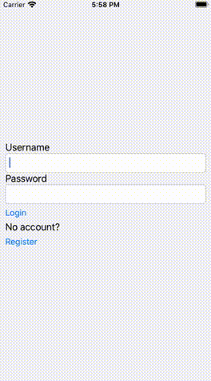

# Combine and URLSession in UIKit

[![Swift Version][swift-image]](https://swift.org/)
[![Platform][Platform-image]](https://developer.apple.com/kr/ios/)

[swift-image]:https://img.shields.io/badge/swift-5.2.2-orange.svg?style=flat
[Platform-image]: https://img.shields.io/badge/Xcode-11.4.1-blue.svg?style=flat

## UIkit + Combine
이 예제는 `UIKit`과 `Combine`을 함께 사용해보기 위한 예제이다.

Network Manager를 호출하여 Login 기능을 구현한다.

**The approach**
Storyboards를 사용하지 않고, UIKit과 MVVM Pattern을 사용한다.

또한 `URLSession`을 테스트하기 위해 [Dependency Injection](https://medium.com/@stevenpcurtis.sc/learning-dependency-injection-using-swift-c94183742187)을 적용한다.

이 방법에서는 [keychain manager](https://medium.com/@stevenpcurtis.sc/secure-user-data-with-keychain-in-swift-337684d6488c)를 사용하여 Token을 저장한다.

## Prerequisites: 
* Swift로 작성된 [Single View Application](https://medium.com/swlh/your-first-ios-application-using-xcode-9983cf6efb71)을 작성할 수 있어야한다.

## Terminology:
Combine: A framework that provides a declarative Swift API for processing values over time

# The Examples
`Combine`은 용도가 다양하며, `SwiftUI`에 연결할 때는 거의 제약이 없다.

The example code shows instances of:
* `UITextField`에 입력된 값이 유효할 때까지 `UIButton`을 잠그도록 pipelines을 설정한다.
* View 내에서 Update할 방법(how)과 항목(what)을 선택하여 asynchronous network call을 수행할 pipeline을 작성한다.
* UI를 update하는 `UITextField`의 텍스트에 따라 `UIButton`의 상태를 동적으로(dynamically) 조정하는 pipeline을 만든다.

# The App:
<br/>

간단한 login과 material스러운 interface가 있다.

사용자 이름과 암호가 입력되면 ViewController는 ViewModel에 API Call을 요청한다.

각 sections은 `LoginViewController` - `LoginViewModel` - `LoginView` 에 중점을 둔다.

## The Detail
**The View Controller**
`LoginViewController`은 `UIKit`에서 쓰이는 `UIViewController`과 크게 다르지 않다.

처음에는 아래와 같이 취소 가능한 개체 `AnyCancellable`을 single 변수로 두었다.

Token이 `deinitialized` 될 때, transaction이 취소될 수 있기 때문이다.

```swift
var pwSub: AnyCancellable?
var unSub: AnyCancellable?
var loginSub: AnyCancellable?
var animSub: AnyCancellable?
var validationSub: AnyCancellable?
```

<br>
반면에 더 나은 접근법은 이러한 subscriptions을 `private var subscriptions = Set<AnyCancellable>()`으로 저장하는 것이다.

```swift
loginViewModel?.shouldNav
    .sink(receiveCompletion: { completion in
    // Handle the error
        print ("completion\(completion)")
}) { [weak self] _ in
    let mvc = MainMenuViewController()
    self?.navigationController?.pushViewController(mvc, animated: true)
}
.store(in: &subscriptions)
```

<br>

탐색(navigation)에 대한 책임(responsibility)을 ViewController에게 맡기고,ViewController는 `navigationController`에게 알린다.

protocol을 준수하는 view model instances를 생성한다.
`UserDataManager()`도 동일한 작업을 수행한다.

```swift
init(viewModel: LoginViewModelProtocol = LoginViewModel(
    networkManager: HTTPManager(session: URLSession.shared),
    userdatamanager: UserDataManager()
    )
)
{
    super.init(nibName: nil, bundle: nil)
    loginViewModel = viewModel
}
```

<br>

ViewModel 측면에서 ViewModel의 `AnyPublisher<Bool, Never>`에 binding 할 수 있고, View를 적절하게 붙일 수 있다.(여기서 `loginButton` 업데이트)

```swift
let validationSub = loginViewModel?.userValidation
    .receive(on: RunLoop.main)
    .assign(to: \.isEnabled, on: loginView.loginButton)
```

<br>

마찬가지로 `UITextField`를 ViewModel에 있는 `@Published var username: String = ""`에 binding 할 수 있다.

```swift
loginView.userNameTextField.addTarget(self, action: #selector(self.userNameTextFieldDidChange(_:)), for: .editingChanged)
```

<br>

정의된 대로 selector를 연결합니다.

```swift
@objc func userNameTextFieldDidChange(_ sender: UITextField) {
    loginViewModel?.username = sender.text ?? ""
}
```

**The View Model**

ViewModel에는 `$`으로 액세스할 수 있는 `@Published var`타입의 publisher가 두 개 있다. 

```swift
@Published var password: String = ""
@Published var username: String = ""
```

<br>

`validLengthUsername`은 아래와 같이 정의된다.

`debounce`는 자용자가 입력을 멈췄을 때만 elements를 receive하도록 한다.

`removeDuplicates`를 사용하면 고유한 elements에만 사용된다.

```swift
@Published var username: String = ""
var validLengthUsername: AnyPublisher<Bool, Never> {
    return $username.debounce(for: 0.2, scheduler: RunLoop.main)
    .removeDuplicates()
    .map{$0.count >= passwordLength ? true : false}
    .eraseToAnyPublisher()
}
```

<br>

비슷하게 password를 확인한다.

```swift
var validLengthPassword: AnyPublisher<Bool, Never> {
    return $password.debounce(for: 0.2, scheduler: RunLoop.main)
        .removeDuplicates()
        .map{$0.count >= passwordLength ? true : false}
        .eraseToAnyPublisher()
}
```

<br>

그리고 `validLengthUsername`와 `validLengthPassword` 모두  `eraseToAnyPublisher`를 사용하여 `publisher`를 downstream `publisher`가 볼 수 있도록 한다.

`.zip`은 두 operators를 합칠 떄 사용하다.

```swift
var userValidation: AnyPublisher<Bool, Never> {
    validLengthUsername
        .zip(validLengthPassword)
        .map { $0 && $1 }
        .eraseToAnyPublisher()
}
```

<br>

몰론 이건 ViewController에서 subscribed 된다.(위에서 처럼)

실제로 ViewController에서 Button이 눌리면, 이제 ViewModel에서 `API` 호출이 이뤄진다.

```swift
func login() {
    pst = httpmgr?.post(url: API.login.url!,
                        headers: ["Content-Type": "application/x-www-form-urlencoded"],
                        data: "email=eve.holt@reqres.in&password=cityslicka".data(using: .utf8)!)
        .receive(on: DispatchQueue.main)
    
    publisher = pst!.sink(receiveCompletion: {
        switch $0 {
        case .finished: break
        case .failure(let error):
            // error should be handled here
            print (error)
        }
    }, receiveValue: {val in
        self.userdatamanager.token = val.token
        self.shouldNavSubject.send(true)
    })
}
```

<br>

이건 keychain에 token을 저장하기 위해 `sink`를 사용하고, `shouldNavSubject`를 사용하여 ViewController로 message를 다시 보낸다.

`shouldNavSubject`는 `PassthroughSubject`를 활용하는 `AnyPublisher<Bool, Never>`로 `Publisher`와 `Subscriber` 사이에 있는 operator이다.

```swift
private let shouldNavSubject = PassthroughSubject<Bool, Never>()
var shouldNav: AnyPublisher<Bool, Never> {
    shouldNavSubject.eraseToAnyPublisher()
}
```

**The HTTPManager**

Networking은 아래 코드처럼 `HTTPManager`가 관리하지만, Protocol이 사용된다는 점에서 기본적인 network manager와 유사하다.

테스트 중에는 `URLSession`을 swap out할 수 있으므로 `API` 호출 시 실제로 `API`에는 도달하지 않는다.

```swift
class HTTPManager<T: URLSessionProtocol> {
    /// A URLProtocol instance that is replaced by the URLSession in production code
    
    let session: T
    
    required init(session: T) {
        self.session = session
    }

    public func post<T: Decodable>(
        url: URL,
        headers: [String : String],
        data: Data
    )
        -> AnyPublisher<T, Error>
    {
        var request = URLRequest(
            url: url,
            cachePolicy: .reloadIgnoringLocalCacheData,
            timeoutInterval: 2.0)
        
        request.httpMethod = "Post"
        request.allHTTPHeaderFields = headers
        request.httpBody = data
        
        return session.response(for : request)
            .map { $0.data }
            .decode(type: T.self,
                    decoder: JSONDecoder())
            .mapError{ $0 }
            .eraseToAnyPublisher()
    }
}
```

<br>

The protocol

```swift
protocol HTTPManagerProtocol {
    associatedtype aType
    var session: aType { get }
    init(session: aType)
    
    func post<T: Decodable>(
        url: URL,
        headers: [String : String],
        data: Data
    )
        -> AnyPublisher<T, Error>
}
```

후반부에서 테스트를 시작할 수 있다.

테스트 중에서는 교체할 수 있는 `URLSession`을 사용하기 때문이다.

`dataTaskPublisher`를 사용할 떄 까다로운데, `URLSession`이 준수하는 `protocol`을 만들고 실제 class나 mocked version에서 반환될 수 있는 `typealias`을 만들어 올바른 `Output` 및 `Failure` types을 얻는다.

```swift
protocol URLSessionProtocol {
    typealias APIResponse = URLSession.DataTaskPublisher.Output
    func response(for request: URLRequest) -> AnyPublisher<APIResponse, URLError>
}

extension URLSession: URLSessionProtocol {
    func response(for request: URLRequest) -> AnyPublisher<APIResponse, URLError> {
        return dataTaskPublisher(for: request).eraseToAnyPublisher()
    }
}
```

## Testing

위에서 봤듯 `URLSession`를 mocked version으로 만든다.

```swift
class URLSessionMock: URLSessionProtocol {
    var jsonName = "RegisterSuccess.json"
    func response(for request: URLRequest) -> AnyPublisher<APIResponse, URLError> {
        let response = HTTPURLResponse(url: request.url!, statusCode: 200, httpVersion: "HTTP/1.1", headerFields: nil)!
        let file = Bundle(for: type(of: self)).path(forResource: jsonName, ofType: nil)!

        let url = URL(fileURLWithPath: file)
        
        guard let data = try? Data(contentsOf: url) else {
            fatalError()
        }
        return Just((data: data, response: response))
            .setFailureType(to: URLError.self)
            .eraseToAnyPublisher()
    }

    typealias CompletionHandler = (Data?, URLResponse?, Error?) -> Void
    // data and error can be set to provide data or an error
    var data: Data?
    var error: Error?
}
```

`HTTPManager`도 mocked version으로 만든다.

```swift
class HTTPManagerMock <T: URLSessionProtocol>: HTTPManagerProtocol {
    let session: T

    required init(session: T) {
      self.session = session
    }
    
    func post<T>(url: URL, headers: [String : String], data: Data) -> AnyPublisher<T, Error> where T: Decodable {
        
        var request = URLRequest(
            url: URL(string: "www.fakeweb.com")!,
            cachePolicy: .reloadIgnoringLocalCacheData,
            timeoutInterval: 2.0)
        
        request.httpMethod = "Post"
        request.allHTTPHeaderFields = headers
        request.httpBody = data
        
        // let session = URLSessionMock()
        return session.response(for: request)
            .map { $0.data }
            .decode(type: T.self,
                    decoder: JSONDecoder())
            .eraseToAnyPublisher()
    }
}
```

이 설정은 테스트 클래스 자체에서 설정된다.

```swift
var lvm: LoginViewModel<HTTPManagerMock<URLSessionMock>>?
let urlSession = URLSessionMock()
let nm = HTTPManagerMock(session: urlSession)
let ud = UserDataManagerMock()
lvm = LoginViewModel(networkManager: nm, userdatamanager: ud)
private var cancellables: Set<AnyCancellable> = []
```

adding a test 

```swift
let expect = expectation(description: #function)
lvm?.password = "test"
lvm?.validLengthPassword.sink(receiveValue: {res in
    XCTAssertEqual(res, false)
    expect.fulfill()
}).store(in: &cancellables)
waitForExpectations(timeout: 2.0)
```

중요한 점은 테스트 중에 데이터를 얻기 위해 실제 API 호출을 사용하지 않고 테스트 대상의 `json` file에서 데이터를 얻는다는 점이다.

# Conclusion
This article is a rather useful implementation of `Combine` using `UIKit`, we can see this in this article. 