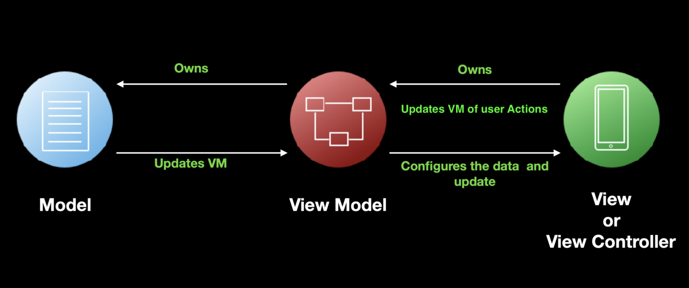
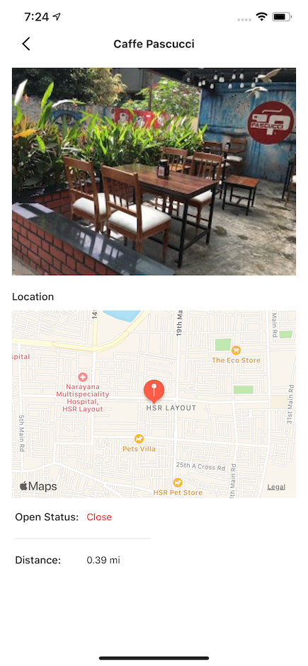
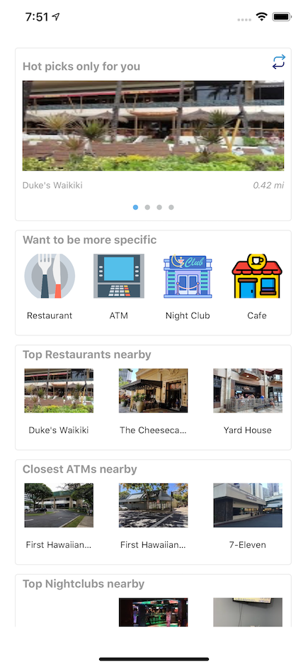

# How to Use UIKit With MVVM and Combine


## **Configuring the ViewModel**



The view shows the name, location, image, open status, and distance of a place from your location. These details will be supplied from the ViewModel for this view. Let us jump to it:

``` swift
class PlaceDetailViewModel {
    // MARK: Output
    @Published private(set) var title = ""
    @Published private(set) var distance = ""
    @Published private(set) var isOpen = false
    @Published private(set) var placeImageUrl: String = ""
    @Published private(set) var location: CLLocation? = nil
    
    private let place: NearbyPlace
    
    init(place: NearbyPlace) {
        self.place = place
        configureOutput()
    }
    
    private func configureOutput() {
        title = place.name
        let openStat = place.openStatus ?? false
        isOpen = openStat
        location = place.location
        placeImageUrl = place.imageURL ?? ""
        
        let currentLocation = CLLocation(latitude: LocationManager.sharedManager.latitude, longitude: LocationManager.sharedManager.longitude)
        guard let distance = place.location?.distance(from: currentLocation) else { return }
        self.distance = String(format: "%.2f mi", distance/1609.344)
    }
}
```

## **What’s going on here?**
Your `ViewModel` receives a `NearbyPlace` object which holds all the relevant information for this particular place. The `ViewModel` then configures the outputs. Outputs are the data that is to be displayed on the view. So far everything is going great.

You may have noticed that all output properties are annotated with the `@Published` keyword. This property wrapper in Combine contains a stored value and its projected value provides users with a Combine publisher, receiving updated values for the property whenever it’s changed. In Swift world, you have to call an update callback or delegate implemented in the view, but in Combine you get it for free!

## **Configuring the View**
``` swift
class PlaceDetailController: UIViewController {
    private var subscriptions = Set<AnyCancellable>()
    
    private var viewModel: PlaceDetailViewModel!
    
    override func viewDidLoad() {
        super.viewDidLoad()
        setupBindings()
    }
    
    private func setupBindings() {
        // Properties that can be assigned using default assign method
        subscriptions = [
            viewModel.$title.assign(to: \.text!, on: titleLabel),
            viewModel.$distance.assign(to: \.text!, on: distanceLabel),
            viewModel.$isOpen.map { $0.openStatusText }.assign(to: \.text!, on: openStatusLabel),
            viewModel.$isOpen.map { $0 ? UIColor.green : UIColor.red }.assign(to: \.textColor!, on: openStatusLabel)
        ]
        
        // Properties require custom assigning
        viewModel.$placeImageUrl.compactMap { URL(string: $0) }
        .sink { [weak self] imageURL in
            self?.placeImageView.kf.setImage(with: imageURL, placeholder: UIImage(named : "placeIcon"), options: nil, progressBlock: nil, completionHandler: { (image, error, cacheType, url) in
                })
        }
        .store(in: &subscriptions)
        
        viewModel.$location.compactMap { location -> (MKCoordinateRegion, MKPointAnnotation)? in
            guard let lat = location?.coordinate.latitude,
                let long = location?.coordinate.longitude else { return nil }
            let center = CLLocationCoordinate2D(latitude: lat, longitude: long)
            let region = MKCoordinateRegion(center: center, span: MKCoordinateSpan(latitudeDelta: 0.01, longitudeDelta: 0.01))
            
            let annotation = MKPointAnnotation()
            annotation.coordinate = center
            return (region, annotation)
        }.sink { [weak self] location in
            self?.mapView.setRegion(location.0, animated: true)
            self?.mapView.addAnnotation(location.1)
        }.store(in: &subscriptions)
    }
    
    }
```
Once the view has been loaded, we set up the bindings of our `ViewModel` configured output properties to our UI components.

Why do we call this binding? Because here you’re not only assigning your UI components to their respective values, you’re also subscribing to any future changes in that property:

`assign(to:on:)`

For clarity, we’ve segregated our binding as the ones which can be assigned directly using the `assign(to:on:)` API of combine, which assigns a publisher’s output to a property of an object. If you rewind to our last section’s discussion, we’ve annotated our properties in `ViewModel` with `@Published`. In the binding we’ve used the projected value of a property, using `$propertyname` to assign the underlying publisher to the assignable properties of our UI component. The result of every assignment is an `AnyCancellable` type.

For example, for assigning `$title` to the `text` property of `titleLabel`, we write `viewModel.$title.assign(to: \.text!, on: titleLabel)`.

All `AnyCancellable` results are stored in a `subscriptions` set, ensuring that your subscriptions are still in memory to receive any upcoming events.

## **Custom Assigning**
For custom handling of attributes, we can use different operators provided by Combine over our `Publishers` , such as `sink(receiveValue:)` and `handleEvents`, to receive the values and work directly on them. In the code snippet above, we used `compactMap` to map the stream of `CLLocation` values from the `$location` publisher to a tuple of `MKCoordinateRegion` and `MKPointAnnotation` followed by `sink` to render the details on the map.

## **Passing UI Events to the ViewModel**
There are times when we need to pass certain UI events to the `ViewModel` for further processes — perhaps an API call, a database query, or something else.



The above screen shows the Nearby home page. Certain UI events occur on this view — user taps to refresh the feed, taps on category, taps on any place, etc. These events trigger certain actions in the `ViewModel` , like triggering the API or on the UI itself, in navigation for instance. For our discussion,let’s take a communication where the user taps to refresh data on screen:

### HomeViewController
``` swift
// HomeViewController
class HomeViewController: UIViewController {
    private var subscriptions = Set<AnyCancellable>()
    private var loadDataSubject = PassthroughSubject<Void,Never>()
    private var viewModel = HomeViewModel()
    
    override func viewDidLoad() {
        super.viewDidLoad()
        prepareTableView()
        setupBinding()
        loadDataSubject.send()
    }
    
    private func setupBinding() {
        viewModel.attachViewEventListener(loadData: loadDataSubject.eraseToAnyPublisher())
        viewModel.reloadPlaceList
            .sink(receiveCompletion: { completion in
                // Handle the error
            }) { [weak self] _ in
                ActivityIndicator.sharedIndicator.hideActivityIndicator()
                self?.tableView.reloadData()
        }
        .store(in: &subscriptions)
    }
    
    @IBAction func refreshButtonPressed(_ sender: Any) {
        ActivityIndicator.sharedIndicator.displayActivityIndicator(onView: view)
        loadDataSubject.send()
    }
}
```

### HomeViewModel
``` swift
// HomeViewModel
class HomeViewModel {
  var reloadPlaceList: AnyPublisher<Result<Void, NearbyAPIError>, Never> {
        reloadPlaceListSubject.eraseToAnyPublisher()
   }
  
  // MARK: Input
    private var loadData: AnyPublisher<Void, Never> = PassthroughSubject<Void, Never>().eraseToAnyPublisher()
    private let reloadPlaceListSubject = PassthroughSubject<Result<Void, NearbyAPIError>, Never>()
  
    func attachViewEventListener(loadData: AnyPublisher<Void, Never>) {
        self.loadData = loadData
        self.loadData
            .setFailureType(to: NearbyAPIError.self)
            .handleEvents(receiveOutput: { [weak self] _ in
                self?.allPlaces.removeAll()
            })
            .flatMap { _ -> AnyPublisher<[NearbyPlace], NearbyAPIError> in
                let placeWebservice = PlaceWebService()
                return placeWebservice
                    .fetchAllPlaceList()
            }
            .receive(on: DispatchQueue.main)
            .handleEvents(receiveOutput: { [weak self] _ in
                self?.tableDataSource.removeAll()
            })
            .sink(receiveCompletion: { _ in },
              receiveValue: { [weak self] places in
                self?.allPlaces.append(contentsOf: places)
                self?.prepareTableDataSource()
                self?.reloadPlaceListSubject.send(.success(()))
            })
            .store(in: &subscriptions)
    }
}
```

A `PassthroughSubject` can be used to send events to subscribers of your subject. Think of this as your water supply pipe from which you take your daily water supply.

In our case the `loadDataSubject` is used by the view to send events to the `ViewModel` to load app data from the server. Whenever the user presses on the refresh button or the view loads for the first time we ask the `ViewModel` to load the data. If you closely look at the `attachViewEventListener(loadData: AnyPublisher<Void, Never>)` implemented in the `ViewModel`, we do not actually pass the `loadDataSubject` to the `ViewModel` to receive the event. Rather we type erase the subject to an `AnyPublisher` and send it. An `AnyPublisher` can only be used to receive events and not send events. By using this type erasure we are avoiding any chance of abuse of the `loadDataSubject` from the `ViewModel`.

A similar approach goes for communication between `ViewModel` and `View`. For reloading our list on a successful API fetch, we use `reloadPlaceList: AnyPublisher<Result<Void, NearbyAPIError>, Never>`

## **Pain of UIKit and Combine Compatibility**
## Missing bindings
Though we have `assign(to:on:)` which uses the key path to bind a publisher to any property, it lags some major binding functionality as its Rx counterpart `bind(to:)` has. Especially for `UIControl`, there’s no straightforward way to send control events to a `AnyPublisher` property. In our case, we’ve used `PublishSubject` and type erasures to send a button tap event. The community was pretty quick to develop wrappers for missing binding functionality for `UIKit` components.

To implement a UIControl binding functionality such as assign, we have to write our own custom publisher which is a lot of overhead for anyone.

Don’t be disheartened. We can still use combine to drive many of our business logic asynchronously and exploit the power of Combine and reactive programming.

## **Property Wrappers and Protocols**
Property wrappers can not be declared in protocol definitions. You may have noticed, we used our `ViewModel`s directly in the view, using their concrete types. This reduces the scope of the reusability of our views. If we were to abstract out `ViewModel`s and expose our outputs and inputs by protocols, we could not use `@Published` directly in protocol definitions. The reason and the workaround are explained in this blog. Feel free to check that out.

## MVVM Sample
[MVVM Practice](https://github.com/gabhisekdev/MVVMDiscussion)